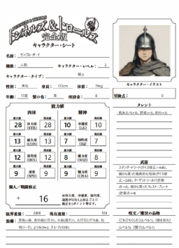

# T&T完全版キャラクターシート オンラインセッション支援ツール

##  T&T完全版キャラクターシート オンラインセッション支援ツール
"T&T完全版キャラクターシート オンラインセッション支援ツール"は、[トンネルズ＆トロールズ完全版](http://www.groupsne.co.jp/products/tt/index.html)(以下、T&Tとする)をオンラインセッションで楽しむ際、キャラクターシートを他の参加者と共有したり、[ココフォリア](https://ccfolia.com/)などのTRPGオンラインセッションサポートツールをより便利に使用するためのチャットパット生成機能などを提供することで、快適に楽しむことを支援するためのツールです。

このツールは、Vue.jsで作成されており、buidしたものをサーバなどに配置することにより、オンライン艦橋で利用することを想定しています。

## 概要/ Overview
本ツールはT&Tのキャラクターシートのオンラインでの共有と、TRPGオンラインセッションサポートツールとの連携を用意化することを目的としています。
また、T&Tでありがちなセービングロールのたびに入る冒険点の計算や、個人修正、レベル、防御点、重量などの計算をサポートします。
なお、このツールはT&Tのルールブックを持っている方が利用することを想定しています。



## 説明 /Description
本ツールは以下の3画面からなります。
各画面は画面上部の"モード切替"文字列をクリックすることで切り替わります。キャラクターシート表示モード時は文字列が消えますが、マウスを画面上部に持っていくことで表示されます。

- キャラクターシート表示モード
- データ表示モード
- データ入力モード

キャラクターシート表示モードは、1画面でキャラクターの概要を見栄え良く表示することを目的とします。
データ表示モードは、実際のデータの詳細を確認したり、TRPGオンラインセッションサポートツールへの出力物を得ることを目的とします。
データ入力モードは、実際のデータの入力を行い、ほかのモードで参照可能にすることを目的にします。また、入力データはJSON形式でダウンロード、アップロードが可能であり、その目的でも使用します。

詳細な使い方は、[使い方の説明](./docs/index.md)を参照してください。


## 使用している主な技術/ Technologies


## 必要な環境変数
[.env](./.env)に以下のファイルを設定してください。
|項目|説明|値|
|---|---|---|
|VITE_SHEET_URL|キャラクターシート表示モードの背景に表示するキャラクターシート画像のURL|[T&T公式](http://www.groupsne.co.jp/products/tt/index.html)のサポートからキャラクターシートを取得し、適切な大きさの画像にし、任意のサーバに配置し、そのURLを指定する。|
|VITE_SAMPLE_PORTRAIT_URL|最初に表示されるキャラクターの肖像画|適切な大きさの画像を任意のサーバに配置し、そのURLを指定する。|

## コマンド一覧
コマンドは root ディレクトリで実行する。

### 環境を構築する
```
npm install
```

### 開発サーバを起動する
```
npm run dev
```

### デプロイする
rootパス以外で利用する場合は --base を指定してください
ビルドの結果は distディレクトリに格納されます。
```
vite build --base=/T-and-T/pc
```

