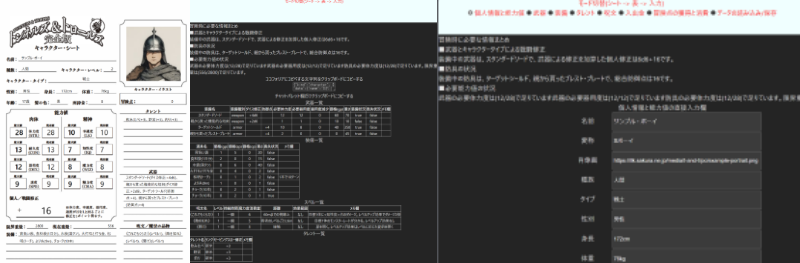
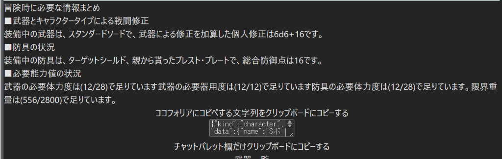
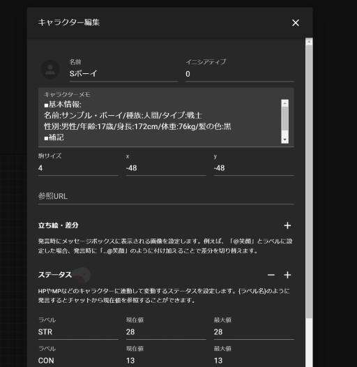
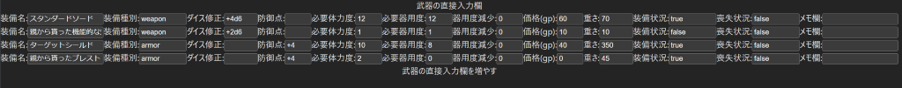
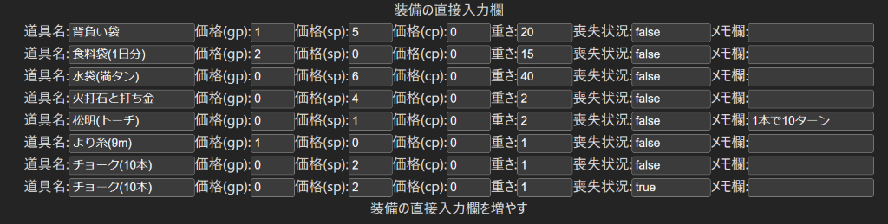
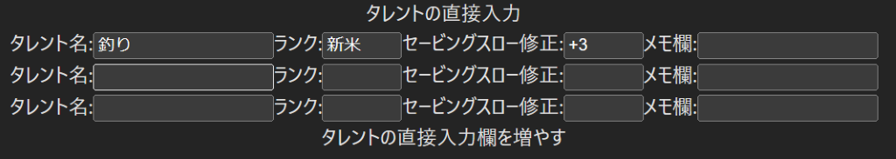
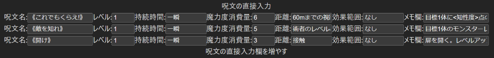
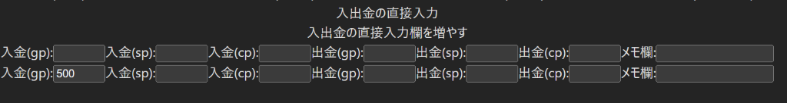
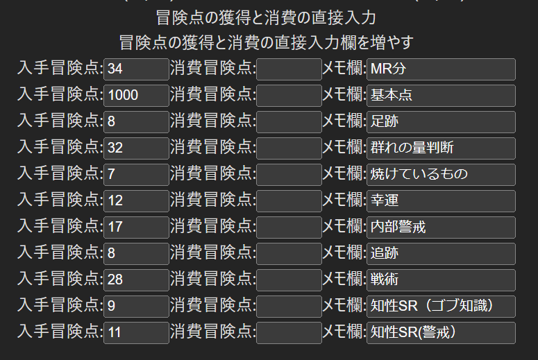
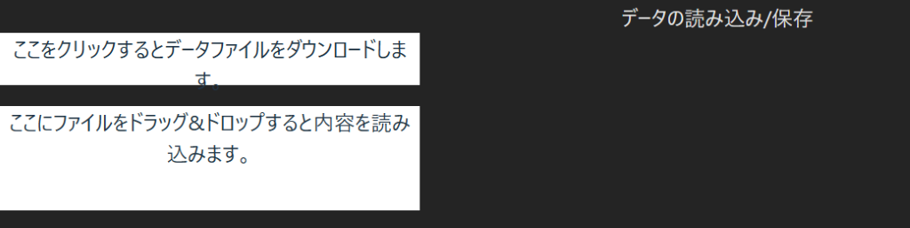

# 使い方の説明

## 概要/ Overview
本ツールはT&Tのキャラクターシートのオンラインでの共有と、TRPGオンラインセッションサポートツールとの連携を用意化することを目的としています。
また、T&Tでありがちなセービングロールのたびに入る冒険点の計算や、個人修正、レベル、防御点、重量などの計算をサポートします。
なお、このツールはT&Tのルールブックを持っている方が利用することを想定しています。

## 注意!!
「データの読み込み/保存についての詳細な説明」で説明しているダウンロード機能により、JSON形式ファイルをダウンロードし、保存することを忘れないでください。
入力データ自体は、ブラウザあるいはタブを閉じると消えてしまいます。

## 画面の説明
本ツールは以下の3画面からなります。
各画面は画面上部の"モード切替"文字列をクリックすることで切り替わります。キャラクターシート表示モード時は文字列が消えますが、マウスを画面上部に持っていくことで表示されます。

- キャラクターシート表示モード
- データ表示モード
- データ入力モード

キャラクターシート表示モードは、1画面でキャラクターの概要を見栄え良く表示することを目的とします。
データ表示モードは、実際のデータの詳細を確認したり、TRPGオンラインセッションサポートツールへの出力物を得ることを目的とします。
データ入力モードは、実際のデータの入力を行い、ほかのモードで参照可能にすることを目的にします。また、入力データはJSON形式でダウンロード、アップロードが可能であり、その目的でも使用します。

## データ表示モードの説明
データ表示モードでは、「ココフォリアにコピペする文字列をクリップボードにコピーする」をクリックすることで、ココフォリアに「貼り付け」するためのデータをクリップボードにコピーできます。

なお、クリップボードにコピーする機能は、https環境でしか利用できません。開発サーバで幼児している場合は、その下のインプットフォームの中身をすべて選択してコピーすることで代用してください。

クリップボードにコピーしたデータをココフォリアで「貼り付け」することでキャラクターの情報を以下のようにココフォリアに反映できます。

## データ入力モードの説明
データ入力モードは以下の8画面からなります。
武器や装備、呪文のデータは手入力です。お手元のT&Tのルールブックを参照して入力してください。
ルールに無いデータ項目や、入力欄の増やし方は各画面で説明します。

- 個人情報と能力値
- 武器
- 装備
- タレント
- 呪文
- 入出金
- 冒険点の獲得と消費
- データの読み込み/保存

### 武器の入力についての詳細な説明

武器の入力画面の、装備種別には武器なら"weapon"、鎧や盾なら"armor"と入力してください。

装備状況は、装備していれば"true"、装備していないなら"false"かtrue以外の文字列を入力してください。装備しているものだけが戦闘修正や総合防御点、必要体力度や必要器用度に含まれます。

価格(gp)は拾ったものならば、ルールブック通りではなく0で大丈夫です。

喪失状況は、既になくしていればtrue"、なくしていないなら"false"かtrue以外の文字列を入力してください。お金の計算や重さの計算に喪失状況を考慮して計算します。

欄が足りない場合、表末尾の「入力欄を増やす」文字列をクリックしてください。
 
### 装備の入力についての詳細な説明

喪失状況は、既になくしていればtrue"、なくしていないなら"false"かtrue以外の文字列を入力してください。お金の計算や重さの計算に喪失状況を考慮して計算します。

欄が足りない場合、表末尾の「入力欄を増やす」文字列をクリックしてください。

### タレントの入力についての詳細な説明

欄が足りない場合、表末尾の「入力欄を増やす」文字列をクリックしてください。

### 呪文の入力についての詳細な説明

欄が足りない場合、表末尾の「入力欄を増やす」文字列をクリックしてください。

### 入出金の入力についての詳細な説明

欄が足りない場合、表タイトル直下の「入力欄を増やす」文字列をクリックしてください。

### 冒険点の入力についての詳細な説明

欄が足りない場合、表タイトル直下の「入力欄を増やす」文字列をクリックしてください。

### データの読み込み/保存についての詳細な説明

「ここをクリックするとデータファイルをダウンロードします。」をクリックすることで、入力内容をJSON形式のファイルで出力できます。

「ここにファイルをドラッグ&ドロップすると内容を読み込みます。」に上でダウンロードしたファイルをドラッグ&ドロップすると読み込みます。